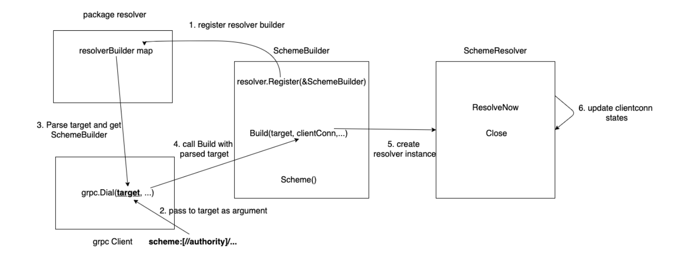
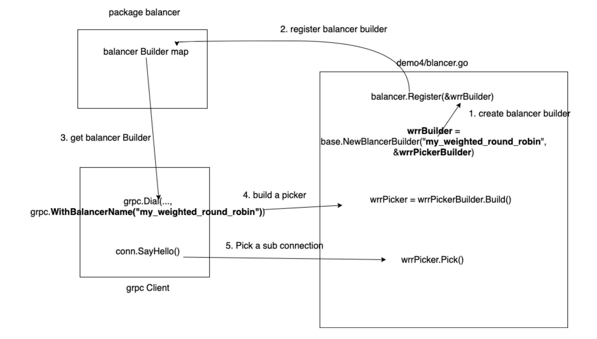
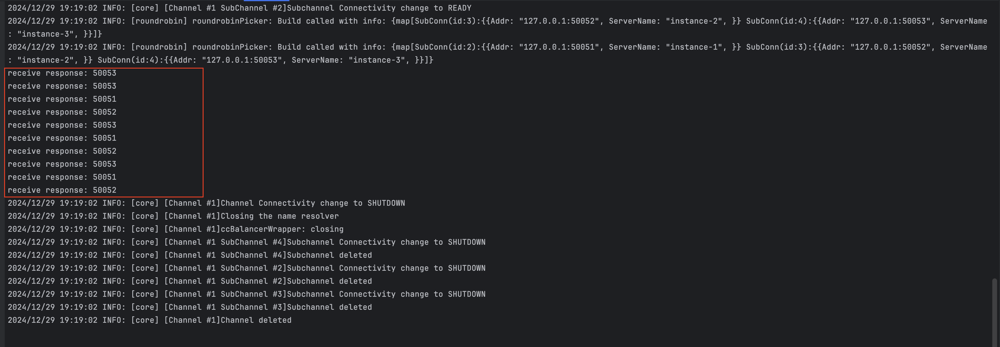

Tiếp nối chuỗi bài viết về cân bằng tải `gRPC`, hôm nay mình sẽ tìm hiểu về các thành phần ở `gRPC client`, đặc biệt là những thành phần liên quan đến cân bằng tải.

## Core component

- `Stub`: client-facing interface, giúp chúng ta có cảm giác gọi một hàm ở remote như ở local.
- `Client connection`: "virtual connection" đến một endpoint, quản lý một hoặc nhiều connection thật đến các gRPC servers (cho phép hiện thực client-side load balancing) và cung cấp các tính năng như phân giản domain name, TLS handshake, reconnect,.. thông qua các module khác.
- `Resolver`: phân giản domain name, ngoài việc cung cấp các cơ chế có sẵn như `passthrough` (connect thẳng tới server), `dns` (phân giải domain name để lấy danh sách server) hay `xDS` thì `resolver` còn cho phép người dùng sử dụng các logic khác như kết hợp với external service discovery.
- `Load balancer`: hiện thực cân bằng tải ở phía client, các cơ chế có sẵn đã được hiện thực ở `Go` như: `pick first`, `round robin`, `weighted round robin`, `least request`,... Giống với `resolver`, gRPC cũng hỗ trợ người dùng custom logic để hiện thực các thuật toán cân bằng tải phức tạp. 
- `Interceptor`: cung cấp khả năng can thiệp vào request trước khi gửi đi.


## Resolver

`Resolver` về cơ bản là một service discovery, khi client muốn gửi request, nó phải biết được địa chỉ của server. Hiện tại gRPC cung cấp một số cơ chế có sẵn để sử dụng:
- `pass through`: sử dụng địa chỉ server được cung cấp, được sử dụng khi kết trực tiếp đến load balancer hoặc 1 server.
- `dns`: phân giải địa chỉ được cung cấp để lấy được danh sách tất cả servers, ví dụ: client có thể sử dụng resolver này khi cụm server đứng sau `headless service` của K8s.
- `unix`: sử dụng cho unix file system.

Bên cạnh những cơ chế `resolver` mặc định, gRPC còn cung cấp API để người dùng có thể tự hiện thực, quá trình đăng kí và sử dụng như sau:



- Đăng kí custom resolver với gRPC, mỗi resolver sẽ được định danh bởi một `scheme`.
- Tạo gRPC client với target có chứa scheme ở trên.
- gRPC sẽ parse target rồi lấy ra resolver tương ứng với scheme.
- Phân tải địa chỉ của servers dựa vào logic được định nghĩa.
- Theo dõi và cập nhật địa chỉ của servers khi có sự thay đổi.

## Balancer

`Balancer` hiện thực client-side load balancing cho gRPC client, ở phần trước, mình có mô tả về `Client connection`, gRPC sử dụng `virtual connection` này để quản lý các connection thực sự đến servers, thông qua đó để quản lý việc phân giải địa chỉ, khởi tạo kết nối, cập nhật trạng thái và **cân bằng tải**.

Giống như `resolver`, bên cạnh cung cấp các thuật toán cân bằng tải phổ biến, gRPC cũng cho phép người đăng kí các thuật toán tuỳ chỉnh, quá trình đăng kí và sử dụng giống với `resolver`.



## Ví dụ

Mình sẽ hiện thực một custom resovler bằng `Go` để làm rõ hơn phần lý thuyết ở phần trước.

- có 3 gRPC servers chạy ở local.
- scheme của resolver là `static`, nó chỉ đơn giản parse địa chỉ của các server từ chuỗi string.

Phần code định nghĩa `builder` và đăng kí tới `gRPC`.

```go
func init() {
	resolver.Register(&StaticBuilder{})
}

type StaticBuilder struct{}

func (sb *StaticBuilder) Build(target resolver.Target, cc resolver.ClientConn,
	opts resolver.BuildOptions) (resolver.Resolver, error) {
	endpoints := strings.Split(target.Endpoint(), ",")

	r := &StaticResolver{
		endpoints: endpoints,
		cc:        cc,
	}
	r.ResolveNow(resolver.ResolveNowOptions{})
	return r, nil
}

func (sb *StaticBuilder) Scheme() string {
	return "static"
}
```

Phần code định nghĩa `static resolver`.

```go
type StaticResolver struct {
	endpoints []string
	cc        resolver.ClientConn
	sync.Mutex
}

func (r *StaticResolver) ResolveNow(opts resolver.ResolveNowOptions) {
	r.Lock()
	r.doResolve()
	r.Unlock()
}

func (r *StaticResolver) Close() {
}

func (r *StaticResolver) doResolve() {
	var addrs []resolver.Address
	for i, addr := range r.endpoints {
		addrs = append(addrs, resolver.Address{
			Addr:       addr,
			ServerName: fmt.Sprintf("instance-%d", i+1),
		})
	}

	newState := resolver.State{
		Addresses: addrs,
	}

	_ = r.cc.UpdateState(newState)
}
```

Khởi tạo client sử dụng `static scheme`. 

```go

const (
	target = "static:///127.0.0.1:50051,127.0.0.1:50052,127.0.0.1:50053"
)

func main() {
    conn, err := grpc.NewClient(target, 
                    grpc.WithTransportCredentials(insecure.NewCredentials()),
                    grpc.WithDefaultServiceConfig(`{"loadBalancingConfig": [{"round_robin":{}}]}`))
}
```

Kết quả chạy chương trình:



## Tổng kết

Thông qua bài viết này, chúng ta đã tìm hiểu về kiến trúc của `gRPC client`, biết được những thành phần và cách chúng hoạt động và tương tác với nhau:
- `Resolver`: phân giải targer để lấy được địa chỉ các `gRPC servers`.
- `Blanacer`: cân bằng tải ở phía client.

điều này sẽ giúp chúng ta sử dụng gRPC dễ dàng hơn, đặt nền tảng để có thể triển khai các mô hình phức tạp hơn ở các bài sau.

## Mã nguồn

Bạn có thể tham khảo và tuỳ chỉnh mã nguồn ở repository [grpc-loadbalancing](https://github.com/dntam00/grpc-loadbalancing/tree/main/static-resolver)


## Tham khảo

- [Load Balancing in gRPC](https://github.com/grpc/grpc/blob/master/doc/load-balancing.md)
- [A27: xDS-Based Global Load Balancing](https://github.com/grpc/proposal/blob/master/A27-xds-global-load-balancing.md)
- [Custom Name Resolution](https://grpc.io/docs/guides/custom-name-resolution/)
- [gRPC client](https://www.sobyte.net/post/2022-03/golang-grpc/)