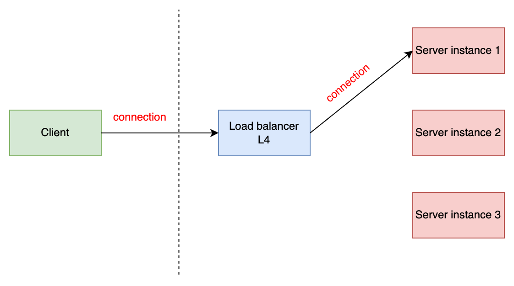
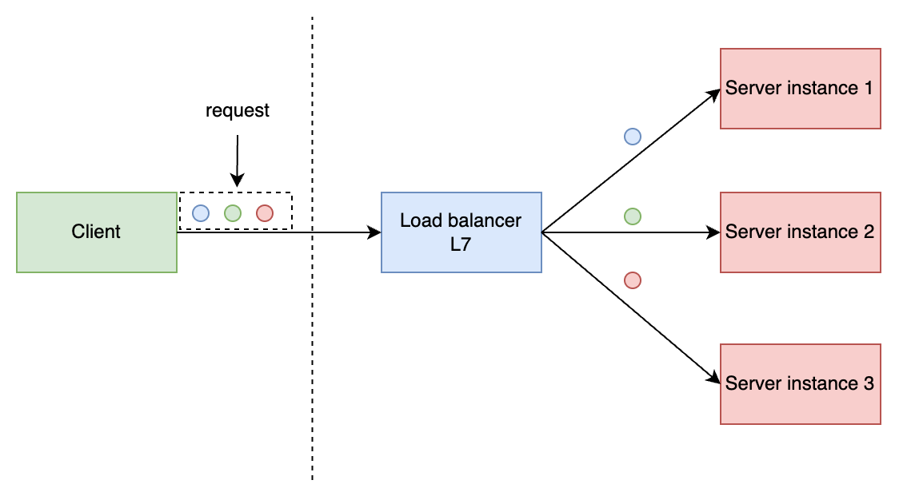
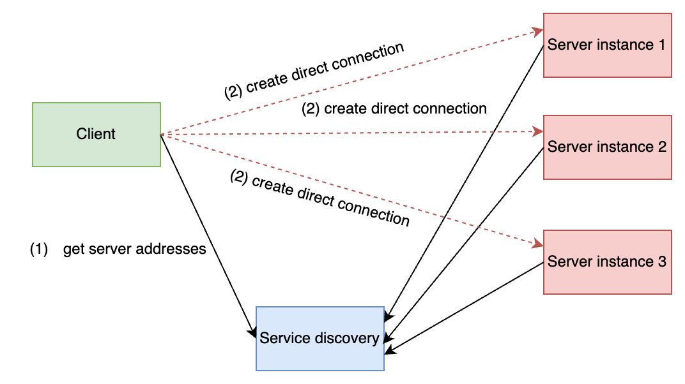

Khi thị trường có xu hướng chuyển dần từ monolithic sang microservice, bài toán giao tiếp giữa các service trở nên rất quan trọng, với những service thông thường hiện nay, mình thấy có 3 cách giao tiếp phổ biến:
- `REST APIs`
- `gRPC`
- `Message queue`

Khi triển khai hệ thống cần xử lý một lượng tải lớn, mỗi loại service sẽ cần phải chạy rất nhiều instance, vậy bài toán đặt ra làm thế nào để chia tải giữa các instance? Độ hiệu quả cũng như chi phí cài đặt, bảo trì như thế nào? Phương pháp áp dụng cho mỗi protocol có khác nhau không?

Để trả lời những câu hỏi trên, mình sẽ viết một chuỗi bài tìm hiểu về cân bằng tải gRPC và các phương pháp hiện thực trong thực tế. Thông qua chuỗi bài viết này, mục tiêu được đặt ra là mình và bạn đọc sẽ hiểu rõ và vận dụng được những kiến thức cân bằng tải gRPC dự án thực tế, cụ thể:
- Hiểu lý thuyết cân bằng tải.
- Hiểu phương pháp cân bằng tải ở `transport layer` và `application layer`.
- Thiết lập và kiểm thử các phương pháp cân bằng tải gRPC.

## Phương pháp

Hiện tại có một vài phương pháp phổ biến để xử lý cân bằng tải cho grPC:
- **Proxy load balancing**: là phương pháp truyền thống, LB sẽ đóng vai trò như một reverse proxy, HAProxy, Nginx, LB của cloud provider,... là các ví dụ.
- **Client side load balancing**: phía client chủ động quản lý connection cũng như cơ chế load balancing, có thể tự custom hoàn toàn dựa trên các specification của gRPC hoặc kết hợp với ZooKeeper/Etcd/Consul,...
- **Look-aside load balancing**: có một external load balancing component chịu trách nhiệm quản lý các servers (service discovery) và trả lời thông tin cho client mỗi khi được yêu cầu.
- **Service mesh**: chịu trách nhiệm hiện thực service discovery và cân bằng tải: `Istio + Envoy proxy`,...

Mỗi phương pháp sẽ có ưu nhược điểm riêng cũng như chi phí cài đặt, bảo trì khác nhau.

Tuy nhiên, trước hết hãy cùng mình tìm hiểu một số kiến thức cơ bản cần nắm rõ như `HTTP/2`, `long-lived TCP connection`,...

### HTTP/2

`HTTP/2` cho phép client và server gửi/nhận cùng lúc nhiều request/response trên cùng 1 TCP connection (`multiplexing`), phân biệt với nhau dựa trên `logical stream`.

`HTTP/2` ra đời giản quyết vấn đề [head-of-line_blocking](https://en.wikipedia.org/wiki/Head-of-line_blocking) của `HTTP/1.1`, ở phiên bản cũ, mặc dù chúng ta có thể tái sử dụng connection, nhưng những requests được xử lý tuần tự, có thể gây hiện tượng thắt cổ chai nếu có nhiều request trên cùng 1 connection.

Với tính chất này, nếu không có yêu cầu gì đặc biệt, chúng ta sẽ có nhu cầu tái sử dụng connection của `HTTP/2` để giảm thiểu chi phí khởi tạo connection, do đó, `TCP connection` trong `HTTP/2` sẽ là `long-lived connection`.

## gRPC load balancing

### Load balancer as proxy

***Transport layer (layer 4)***

Khi cân bằng tải ở tầng `transport`, LB sẽ làm việc với các gói tin TCP, một khi client khởi tạo connection tới LB, nó sẽ tạo 1 connection tương ứng đến một backend server rồi chuyển tiếp tất cả gói tin dựa trên sự ánh xạ này, sự ánh xạ này sẽ được giữ cho đến khi connection bị đóng, từ tổng thể, 2 connection được tạo ra có thể được xem là 1 `persistent connection`.

Do tính chất `persistent connection`, LB sẽ cân bằng tải cho quá trình thiết lập connection, một khi connection đã được tạo, tất cả request sẽ được gửi thông nó, mình gọi nó là `connection-based load balancing`. Ở ví dụ như hình trên, nếu client chỉ tạo 1 connection thì sẽ gây ra hiện tượng `server instance 2` hoặc `server instance 3` ở trạng thái `"thư giãn"`.

<!-- Tuy nhiên, vấn đề xuất hiện vì tính chất `long-lived` này, khi LB tạo connection tới một backend server, tất cả những requests sau đó sẽ được gửi đến `server instance 1`, 2 servers còn lại sẽ ngồi chơi. Khi tạo mới một connection khác, tuỳ vào thuật toán `load balancing` ở LB, connection mới có thể sẽ tới `server instance 2` hoặc `server instance 3`. Vậy bạn có thể thấy, dù cho LB load balance ở `layer 4` hay `layer 7` thì kiểu load balancing này là `connection-based load balancing`. -->

Để giải quyết vấn đề này, chúng ta sẽ sử dụng kĩ thuật `pooling` ở phía client, mục đích là tạo nhiều connections thông qua LB và sử dụng chúng để gửi request. Khi pool được tạo:
- Tất cả connections sẽ được LB phân tải dựa trên thuật toán đã được cấu hình.
- Client sẽ thực hiện chia tải **từng request** trên **từng connection** ở trong pool.
 
Tuy nhiên, chi phí để hiện thực ở phía client sẽ cao hơn vì các lý do:
- Quản lý pool
- Cân bằng tải requests dựa vào connection ở trong pool. 
- Phụ thuộc vào ngôn ngữ lập trình được sử dụng.

***Điều gì sẽ xảy ra khi scale server?***

Khi một server mới được thêm vào cụm backend, nếu pool ở client của chúng ta đã đạt đến số connection tối đa thì cách làm này gặp vấn đề lớn, sẽ không có connection mới nào được khởi tạo đến server mới và dẫn đến sự quá tải ở các server đang có, dẫn đến sập server nếu số lượng request tăng. Để giải quyết vấn đề này, chúng ta cần có cơ chế refresh pool, mỗi connection trong pool sẽ có 1 thời gian sống nhất định, client sẽ chạy 1 job để refresh pool theo cơ chế như:
- Đóng những connection đã hết thời gian sống.
- Đóng những connection bị lỗi.
- Khởi tạo connection mới thông qua LB.

Điều này đảm bảo connection sẽ được chia tải đều đến các server, tuy nhiên chúng ta cần tính toán kĩ những số liệu trên dựa trên đặc điểm chịu tải của từng service, việc này có thể được làm thông qua quá trình `benchmark` hệ thống.

<!-- ### Layer 7 -->
***Application layer (layer 7)***

Khi LB hoạt động ở tầng `application`, nó sẽ sử dụng các thông tin về request để cân bằng tải, cũng với ví dụ client tạo 1 connection tới LB như ở trên rồi gửi requests, lúc này LB sẽ cân bằng tải từng request một tới các backend server dựa trên các thuật toán được cấu hình.

Ở tầng `application`, LB sử dụng được nhiều thông tin hơn để cân bằng tải, do đó có thể hỗ trợ các thuật toán cân bằng tải phức tạp. Tuy nhiên, vì cần phải xem nội dung của request, hiệu năng lúc này sẽ giảm xuống so với trường hợp LB hoạt động ở tầng `transport`.

***Không sử dụng load balancer?***

Đối với những hệ thống yêu cầu khắt khe về hiệu năng, sử dụng load balancer có lẽ không phải là giải pháp tốt. Client có một lợi thế khi sử dụng `load balancer` là nó không cần phải quan tâm đến địa chỉ IP cụ thể của backend hay những thứ khác liên quan đến hạ tầng, tất cả những thứ nó cần phải biết là địa chỉ của load balancer, nếu chúng ta không sử dụng load balancer, một vấn đề mới xuất hiện, **làm thế nào để client và server tìm thấy nhau?**

Đây là câu hỏi kinh điển gắn liền với thuật ngữ `service discovery`, có một service thứ 3 đứng ra làm cầu nối giữa client và server, service này lưu thông tin của server và trả lời mỗi khi client hỏi hoặc chủ động thông báo mỗi khi có sự thay đổi. Khi client có được địa chỉ của các server thông qua service thứ 3 này, nó sẽ khởi tạo connection trực tiếp đến các server và **chia tải request** trên các connection này, việc load balancing đã trở thành `client-side load balacing`, `gRPC client` đang đảm nhiệm việc cân bằng tải, khi mình nói đến `gRPC client`, tức là việc xử lý này sẽ được xử lý bởi `gRPC`, lập trình viên không cần hiện thực thêm gì.

Ý tưởng này có thể được hiện thực thông qua nhiều mô hình:
- Service mesh by `Istio + Envoy proxy`: 
    - control plane: `service discovery`, cấu hình load balancing policy.
    - data plance: Envoy proxy cân bằng tải dựa trên các thông tin được cấu hình ở `control plance`.
- [xDS API](https://github.com/grpc/proposal/blob/master/A27-xds-global-load-balancing.md): `look-aside` load balancing, `gRPC client` hỗ trợ việc sử dụng xDS API của Envoy thông qua `resolver` và `LB plugin`, `resolver` và `LB plugin` sẽ cần tương tác với một `xDS server`.

Để tăng hiệu năng cũng như throughput về mặt số lượng request, chúng ta cũng có thể áp dụng kĩ thuật pooling ở phía client cho phương pháp này.

## Tổng kết

Ở bài viết này, mình đã phân tích ý tưởng load balancing grpc, có 2 điều cần hiểu rõ để tránh mơ hồ trong lúc hiện thực các phương pháp này:
- `connection-based load balancing:` chia tải từng connection đến từng backend server, những connection này có tính chất `long-lived`.
- `request-based load balancing:` chia tải từng request đến từng connection, có thể hiểu chia tải ở tầng ứng dụng.

Ở các bài tiếp theo, mình sẽ đi vào hiện thực và kiểm thử các phương pháp cân bằng tải gRPC để làm rõ hơn phần lý thuyết này.

## Tham khảo

- [gRPC Load Balancing](https://grpc.io/blog/grpc-load-balancing/)
- [Exploring gRPC Load Balancing: Gateway, Service Mesh, and xDS with Go](https://phuc-ch.medium.com/exploring-grpc-load-balancing-gateway-service-mesh-and-xds-with-go-a527ab0e7ce8)
- [GRPC and Connection Pooling](https://arpittech.medium.com/grpc-and-connection-pooling-49a4137095e7)