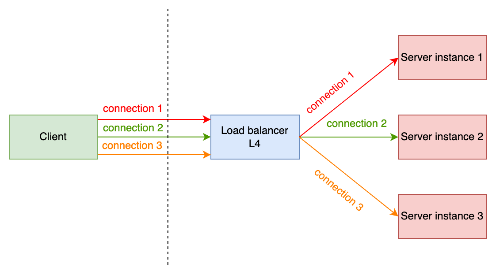
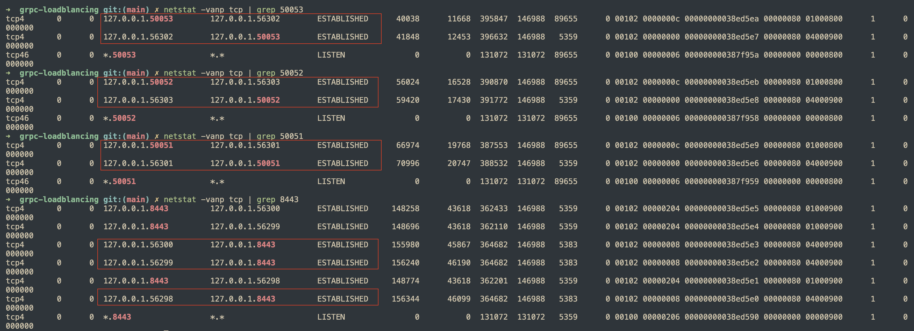

[Ở bài viết đầu tiên về cân bằng tải gRPC](https://notes-ngtam.pages.dev/posts/grpc-load-balancer), mình đã tìm hiểu về các ý tưởng cân bằng tải cho `gRPC` protocol, dựa trên phần lý thuyết đó, hôm nay mình sẽ làm một ví dụ sử dụng `load balancer`. Ở mô hình này, `load balancer` đóng vai trò như một `reverse proxy` cho cụm backend server.

## Load balancer / Reverse proxy

Chúng ta cần một load balancer đứng giữa client và server, có nhiều ứng viên có thể làm được việc này một cách hiệu quả, ví dụ:
- HAProxy
- Nginx
- LB của các cloud provider

**Ưu điểm**
- Dễ cài đặt và sử dụng.
- Không phụ thuộc vào ngôn ngữ lập trình khi hiện thực client/server.
- Tăng tính an toàn cho server.
- Có thể scale bằng cách thêm nhiều instance của load balancer.

**Nhược điểm**
- Nếu không quản lý tốt, load balancer có thể là điểm gây lỗi duy nhất (single point of failure).
- Tăng latency của request.

## Hiện thực và kiểm tra

Ví dụ này của mình sử dụng `HAProxy` làm load balancer và server/client được hiện thực bằng `Go`.

***gRPC proto***
```
syntax = "proto3";

package dnt;

option go_package = "/model";

service DemoService {
  rpc SayHello (HelloRequest) returns (HelloResponse);
  rpc SayHelloStream(stream HelloRequest) returns (stream HelloResponse);
}

message HelloRequest {
  string name = 1;
}

message HelloResponse {
  string serverId = 1;
}
```


### Layer 4

Khi cân bằng tải ở L4, chúng ta sẽ nói đến `connection-based loadbalancing`, mô hình như sau:



Việc cân bằng tải được thực hiện **ở giai đoạn thiết lập connection**, sau đó, LB sẽ như một proxy để chuyển tiếp các requests từ các connection đến server tương ứng.

***HAProxy***

Cấu hình file `haproxy.cfg` có một vài điểm cần chú ý như sau:

- `frontend lb_grpc`: chỉ dẫn `HAProxy` lắng nghe kết nối ở port `8443`.
- `backend be_grpc`: khai báo các backend servers.
- `mode tcp` cấu hình HAProxy hoạt động ở L4 (TCP)
- `balance roundrobin`: sử dụng thuật toán `roundrobin` để cân bằng tải connection.

```
# HAProxy version: 3.1.0-f2b9791
global
  tune.ssl.default-dh-param 1024

defaults
  timeout connect 10000ms
  timeout client 60000ms
  timeout server 60000ms

frontend lb_grpc
  mode tcp
  bind *:8443 proto h2
  default_backend be_grpc

# gRPC servers running on port 50051-50052-50053
backend be_grpc
  mode tcp
  balance roundrobin
  option httpchk HEAD / HTTP/2
  server srv01 127.0.0.1:50051
  server srv02 127.0.0.1:50052
  server srv03 127.0.0.1:50053
```

Chạy HAProxy ở môi trường local bằng lệnh `haproxy -f /opt/homebrew/etc/haproxy.cfg`, kết quả của lệnh `netstat` cho thấy `HAProxy` đang lắng nghe ở port `8443`.


***Server***

Mình sẽ chạy 3 `gRPC server` lắng nghe trên 3 port, có method sẽ trả về `server ID` mỗi khi nhận request từ phía client, mục đích thống kê cho kết quả test.

```go
func main() {
	go serve("50051")
	go serve("50052")
	go serve("50053")
	ctx, stop := signal.NotifyContext(context.Background(), syscall.SIGINT, syscall.SIGTERM)
	defer stop()
	<-ctx.Done()
}

func serve(port string) {
	lis, err := net.Listen("tcp", ":"+port)
	if err != nil {
		log.Fatalf("failed to listen: %v", err)
	}
	s := grpc.NewServer()
	pb.RegisterDemoServiceServer(s, &server{serverId: port})

	fmt.Println("server is running on port " + port)
	if err := s.Serve(lis); err != nil {
		log.Fatalf("failed to serve: %v", err)
	}
}
```

***Client***

Để kiểm tra cân bằng tải L4, mình sử dụng `unuary method` của gRPC, ý tưởng để xây dựng chương trình kiểm tra:

- Tạo 3 clients `gRPC`, gRPC mặc định sử dụng `passthrough resolver` nên 3 clients tương ứng với 3 connections.
- Bắt đầu gửi requests trên mỗi client mỗi `20ms`. 


Theo như những phân tích ở trước, L4 thực hiện cân bằng tải lúc thiết lập connection, do đó kết quả kiểm tra này phải chứng minh được tất cả requests được gửi trên mỗi connection sẽ chỉ được xử lý bởi 1 server duy nhất, mình sử dụng thông tin `server ID` cho mục đích này.

```go
func unaryTest(index int, requests *int, c pb.DemoServiceClient, responses map[string]bool, responseLock *sync.Mutex, stopCh chan struct{}) {
	ticker := time.NewTicker(requestInterval)
	defer ticker.Stop()

stop:
	for {
		select {
		case <-stopCh:
			break stop
		case <-ticker.C:
			go doSendUnaryRequest(index, requests, c, responses, responseLock)
		}
	}
	fmt.Printf("client %v make %v requests, received all response from %v server(s), detail: %+v\n", index, requests, len(responses), responses)
}
```

***Kết quả***

Sử dụng `netstat` để kiểm tra số lượng connection từ client tới HAProxy và từ HAProxy tới server.



Chạy chương trình một thời gian, dựa vào kết quả ở hình dưới, mình thấy **tất cả requests trên một client được sử lý bởi duy nhất một server**, điều này đúng với những điều mình đã phân tích.


### Layer 7

***HAProxy***

Lần này, `HAProxy` sẽ sử dụng `mode http` để hoạt động ở `L7`.

```
# HAProxy version: 3.1.0-f2b9791
global
  tune.ssl.default-dh-param 1024

defaults
  timeout connect 10000ms
  timeout client 60000ms
  timeout server 60000ms

frontend lb_grpc
  mode http
  bind *:8443 proto h2
  default_backend be_grpc

# gRPC servers running on port 50051-50052-50053
backend be_grpc
  mode http
  balance roundrobin

  server srv01 127.0.0.1:50051 check proto h2
  server srv02 127.0.0.1:50052 check proto h2
  server srv03 127.0.0.1:50053 check proto h2
```

Mô hình hoạt động như hình sau:


***Client***

Ở phía client, bên cạnh `unary method`, lần này mình sẽ sử dụng thêm `stream method` để kiểm tra.

**Unary method**

Lần này việc cân bằng tải ở HAProxy sẽ dựa vào request, nên mình kì vọng requests ở mỗi client sẽ được xử lý bởi cả 3 servers.

***Kết quả***

Đúng như kì vọng, requests từ mỗi client được `HAProxy` gửi tới cả 3 servers.


**Bidirectaional stream method**

Đối với `bidirectaional stream method` của gRPC, một khi method được gọi, client và server có thể gửi message cho nhau liên tục, vậy những message này phải được xử lý bởi cùng 1 backend server để method có thể hoạt đúng chức năng. Hãy kiểm tra với HAProxy về việc cân bằng tải này với thiết lập như sau:
- Gọi `bidirectaional stream method` trên mỗi client.
- Trên mỗi stream, client gửi `5000 messages` đến server.

```go
func streamTest(index int, requests *int, client pb.DemoServiceClient, responses map[string]bool, responseLock *sync.Mutex) {
	*requests = *requests + 1
	stream, err := client.SayHelloStream(context.Background())
	if err != nil {
		log.Fatalf("could not call SayHello: %v", err)
	}

	for i := 0; i < requestOnStream; i++ {
		req := &pb.HelloRequest{
			Name: fmt.Sprintf("client %d", i),
		}
		if err := stream.Send(req); err != nil {
			log.Fatalf("failed to send request: %v", err)
		}
		response, err := stream.Recv()
		if err != nil {
			log.Fatalf("failed to receive response: %v", err)
		}
		responseLock.Lock()
		responses[response.ServerId] = true
		responseLock.Unlock()
	}
	if err := stream.CloseSend(); err != nil {
		log.Fatalf("failed to close stream: %v", err)
	}
	fmt.Printf("client %v make %v requests, received all response from %v server(s), detail: %+v\n", index, *requests, len(responses), responses)
}
```

***Kết quả***

Tất cả messages trên mỗi stream được xử lý bởi 1 server và ta cũng có thể thấy, HAProxy cân bằng tải 3 stream đến 3 servers.


***Nhận xét***

Về mặt gửi nhận message, `bidirectional stream` của gRPC cũng tựa tựa `web socket`, protocol có tính [stickiness](https://docs.aws.amazon.com/prescriptive-guidance/latest/load-balancer-stickiness/options.html), do đó bạn sẽ thấy, khi mình cấu hình `HAProxy` ở L7, mình không cần phải quan tâm đến tính năng `stick table`. Về cơ bản, `HAProxy` đã hiện thực những tính chất này khi cân bằng tải `gRPC`, mà thực chất là `HTTP/2`.

## Tổng kết

Ở bài viết này, mình đã phân tích sâu hơn cách load balancer cân bằng tải gRPC protol với những chương trình kiểm tra trên `HAProxy`, qua đó hiểu thêm về cách connection, requests được xử lý.
- LB hoạt động ở L4 sẽ thực hiện cân bằng tải ngay khi connection được thiết lập.
- LB hạot động ở L7 sẽ thực hiện cân bằng tải requests.
- Đặc tính `stickiness` tự nhiên của `stream method` giống với `web socket`, vì vậy nếu chỉ để cân bằng tải, chúng ta không cần sử dụng tính năng này trên các LB.

## Mã nguồn

Bạn có thể tham khảo mã nguồn ở repository [grpc-loadblancing](https://github.com/dntam00/grpc-loadblancing).

## Tham khảo

- [gRPC Load Balancing](https://grpc.io/blog/grpc-load-balancing/)
- [gRPC - HaProxy](https://www.haproxy.com/documentation/haproxy-configuration-tutorials/load-balancing/grpc/)
- [haproxy and HTTP/2](https://andreaskaris.github.io/blog/networking/haproxy-and-h2c/)