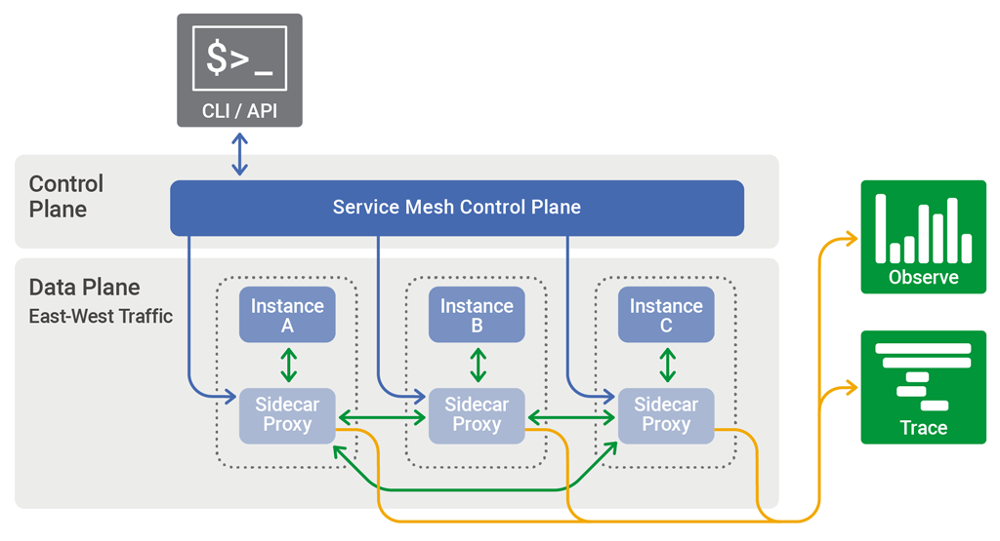
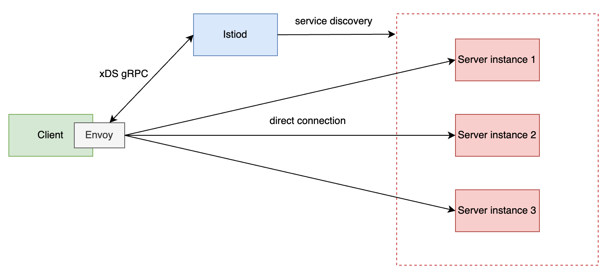

Tiếp theo với chuỗi bài tìm hiểu `gRPC load balancing`, bài viết hôm nay thảo luận về việc sử dụng service mesh để cân bằng tải gRPC trong K8s. Chủ đề chính vẫn là `gRPC load balancing` nên những kiến thức khác mình chỉ lướt qua ở mức vừa đủ để các bạn có thể theo dõi bài viết.

## Service mesh

**Service mesh là gì?**

Service mesh là công cụ tạo ra một lớp hạ tầng xử lý việc giao tiếp giữa các service trong ứng dụng, có một số tính năng nổi bật như:

- Service discovery
- Load balancing
- mTLS
- Observability
- Traceability

Kiến trúc của 1 service mesh:



Như bạn có thể thấy, có 2 thành phần chính trong service mesh:
- `Control plane`: chịu trách nhiệm điều khiển, cấu hình các rule để quản lý mesh.
- `Data plane`: hiện thực các rule từ `control plane`, xử lý quá trình giao tiếp giữa các service trong mesh bằng `sidecar proxy`.

## Service mesh trong K8s

Mình sử dụng `Isito - Envoy proxy` để hiện thực trong bài viết này.

***[Isito - Envoy](https://istio.io/latest/docs/ops/deployment/architecture/)***

Isito là một công cụ triển khai service mesh, chúng ta có thể triển khai trên K8s hoặc cụm máy ảo.
- `Control plane`: Istiod.
- `Data plane`: `Envoy proxy` được triển khai cùng với service trong cùng một pod.

*Mô hình hoạt động cân bằng tải gRPC như sau:*



- `Istiod` sẽ đóng vai trò `service discovery` và cập nhật cho `envoy proxy` khi có sự thay đổi ở backend server như scale-out, scale-in.
- `Envoy proxy` sẽ cân bằng tải `gRPC` ở `layer 7` sau khi tạo connection trực tiếp tới các backend servers.

***kube-proxy***

Để có sự so sánh tại sao chúng ta cần dùng một công cụ ngoài K8s để cân bằng tải, hãy cùng phân tích qua những thành phần sẵn có của K8s.

`Service` trong K8s sử dụng `kube-proxy` để thực hiện việc giao tiếp network, `kube-proxy` sử dụng `iptables` để forward các gói tin từ client đến pod đang chạy các server, hoạt động chủ yếu ở `layer 4`, ở vai trò này nó giống như một load balancing hoạt động ở `layer 4`. Nếu sử dụng `kube-proxy`, chúng ta phải sử dụng `connection pool` để đảm bảo việc cân bằng tải hoạt động đúng như mong muốn.

## Hiện thực

- Mình sử dụng [k3d](https://k3d.io) để chạy k8s ở máy local và [task](https://taskfile.dev/#/) để làm alias cho các công việc như build hay triển khai.
- Cài istio vào cluster K8s.


***Server***

Phần code của server đơn giản chỉ có 2 method `unary` và `stream`, trả về `pod name` mỗi khi xử lý request nhằm mục đích thống kê ở phía client.

```go
func (s *server) SayHello(ctx context.Context, req *pb.HelloRequest) (*pb.HelloResponse, error) {
	fmt.Printf("server %v receive message\n", s.serverId)
	return &pb.HelloResponse{ServerId: s.serverId}, nil
}

func (s *server) SayHelloStream(stream pb.DemoService_SayHelloStreamServer) error {
	for {
		_, err := stream.Recv()
		if err != nil {
			return fmt.Errorf("failed to receive a request: %v", err)
		}
		fmt.Printf("server %v receive message\n", s.serverId)

		// Send a response back to the client
		res := &pb.HelloResponse{
			ServerId: s.serverId,
		}

		// Send the response to the client
		if err := stream.Send(res); err != nil {
			return fmt.Errorf("failed to send response: %v", err)
		}
	}
}
```

Triển khai với tên `hello-sidecar-server` và dựng một `service` cho cụm backend.

```yaml
apiVersion: apps/v1
kind: Deployment
metadata:
  name: hello-sidecar-server
  labels:
    app: hello-sidecar-server
    sidecar.istio.io/inject: "true"
spec:
  replicas: 3
  selector:
    matchLabels:
      app: hello-sidecar-server
  template:
    metadata:
      labels:
        app: hello-sidecar-server
    spec:
      serviceAccountName: server-user
      containers:
      - name: hello-sidecar-server
        ports:
          - protocol: TCP
            containerPort: 50051
        image: localhost:5001/hello-sidecar-server:latest
        env:
          - name: POD_NAME
            valueFrom:
              fieldRef:
                fieldPath: metadata.name
          - name: NAMESPACE
            value: "default"
        resources:
          limits:
            cpu: "200m"
            memory: "250Mi"
          requests:
            cpu: "100m"
            memory: "100Mi"
        readinessProbe:
          exec:
            command: [ "/bin/grpc_health_probe", "-addr=:50051", "-rpc-timeout=4s" ]
          initialDelaySeconds: 5
          timeoutSeconds: 5
        livenessProbe:
          exec:
            command: [ "/bin/grpc_health_probe", "-addr=:50051", "-rpc-timeout=4s" ]
          timeoutSeconds: 5

---
apiVersion: v1
kind: Service
metadata:
  name: hello-sidecar-server
spec:
  selector:
    app: hello-sidecar-server
  ports:
    - port: 5005
      name: hello-sidecar-server
      protocol: TCP
      targetPort: 50051
```

***Client***

Ở client lần này mình cũng sử dụng 2 method `unary` và `stream` để kiểm tra cách cân bằng tải bằng `envoy proxy` và `kube-proxy`.

**unary test**

```go
func unaryTest(index int, wg *sync.WaitGroup) {
	defer wg.Done()
	target := getTarget()
	conn, err := grpc.NewClient(target, grpc.WithTransportCredentials(insecure.NewCredentials()))
	if err != nil {
		log.Fatalf("connect to server %v fail: %v", target, err)
	}
	defer func() {
		_ = conn.Close()
	}()

	client := pb.NewDemoServiceClient(conn)

	responses := make(map[string]int)

	fmt.Printf("start gRPC client %v\n", index)

	for i := 0; i < numberOfRequests; i++ {
		res, err := client.SayHello(context.Background(), &pb.HelloRequest{Name: "client"})
		if err != nil {
			log.Printf("client %v failed to call SayHello: %v", index, err)
			continue
		}
		responses[res.ServerId] = responses[res.ServerId] + 1
		time.Sleep(requestInterval)
	}
	fmt.Printf("client %v make %v requests, received all response from %v server(s), detail: %+v\n", index, numberOfRequests, len(responses), responses)
}
```

**stream test**

```go
func streamTest(index int, wg *sync.WaitGroup) {
	defer wg.Done()
	target := getTarget()
	conn, err := grpc.NewClient(target, grpc.WithTransportCredentials(insecure.NewCredentials()))
	if err != nil {
		log.Fatalf("connect to server %v fail: %v", target, err)
	}
	defer func() {
		_ = conn.Close()
	}()

	client := pb.NewDemoServiceClient(conn)

	responses := make(map[string]int)

	fmt.Printf("start gRPC client %v\n", index)
	stream, err := client.SayHelloStream(context.Background())
	if err != nil {
		log.Fatalf("could not call SayHello: %v", err)
	}

	for i := 0; i < numberOfRequests; i++ {
		req := &pb.HelloRequest{
			Name: fmt.Sprintf("client %d", i),
		}
		if err := stream.Send(req); err != nil {
			log.Fatalf("failed to send request: %v", err)
		}
		response, err := stream.Recv()
		if err != nil {
			log.Fatalf("failed to receive response: %v", err)
		}
		responses[response.ServerId] = responses[response.ServerId] + 1
	}
	if err := stream.CloseSend(); err != nil {
		log.Fatalf("failed to close stream: %v", err)
	}
	fmt.Printf("client %v make %v requests, received all response from %v server(s), detail: %+v\n", index, numberOfRequests, len(responses), responses)
}
```

Triển khai 2 client, có sử dụng `envoy proxy` và không sử dụng `envoy proxy`.
- `sidecar.istio.io/inject: "false"`: ngăn chặn `istiod` inject sidecar proxy vào pod của client.
- `hello-sidecar-server.default.svc.cluster.local`: endpoint của service backend.

File `yaml` triển khai client có `envoy proxy`.
```yaml
apiVersion: apps/v1
kind: Deployment
metadata:
  name: hello-sidecar-client
  labels:
    app: hello-sidecar-client
spec:
  replicas: 1
  selector:
    matchLabels:
      app: hello-sidecar-client
  template:
    metadata:
      labels:
        app: hello-sidecar-client
    spec:
      containers:
      - name: hello-sidecar-client
        image: localhost:5001/hello-sidecar-client:latest
        env:
          - name: POD_NAME
            valueFrom:
              fieldRef:
                fieldPath: metadata.name
          - name: NAMESPACE
            value: "default"
          - name: GRPC_SERVER_ADDR
            value: "hello-sidecar-server.default.svc.cluster.local:5005"
        resources:
          limits:
            cpu: "200m"
            memory: "250Mi"
          requests:
            cpu: "100m"
            memory: "100Mi"
```

File `yaml` triển khai client không có `envoy proxy` chỉ khác phần `annotations`.
```yaml
spec:
  replicas: 1
  selector:
    matchLabels:
      app: hello-client
  template:
    metadata:
      labels:
        app: hello-client
      annotations:
        sidecar.istio.io/inject: "false"
```

## Kiểm tra

Triển khai server và client bằng lệnh `task server:deploy` và `task client:deploy`.


***kube-proxy***

`kube-proxy` cân bằng tải ở `layer 4` nên tất cả request từ 1 client sẽ được xử lý bởi 1 backend server duy nhất.


***envoy-proxy***

- `Envoy proxy` cân bằng tải ở `layer 7` nên khi kiểm tra với `unary method`, requests từ 1 client có thể được xử lý bởi cả 3 backend servers.
- Đối với `stream method`, tất cả messages trên 1 stream đều được xử lý bởi 1 backend server duy nhất, đảm bảo tính đúng đắn về chức năng của protocol.


## Tổng kết

Qua bài viết này, mình đã hiện thực service mesh trong K8s để cân bằng tải gRPC cũng như kiểm tra lại các lý thuyết đã được phân tích ở các bài viết trước. Một số kiến thức quan trọng cần lưu ý:
- Servie mesh và mô hình hoạt động.
- `Kube-proxy` hoạt động cân bằng tải ở `L4`.
- `Envoy proxy` hoạt động cân bằng tải ở `L7`.


## Mã nguồn

Bạn có thể tham khảo mã nguồn ở repository [grpc-loadblancing](https://github.com/dntam00/grpc-loadbalancing/tree/main/sidecar-envoy).