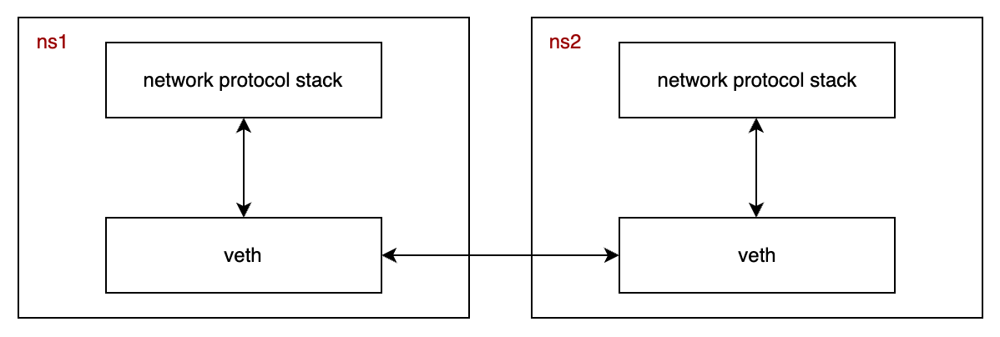
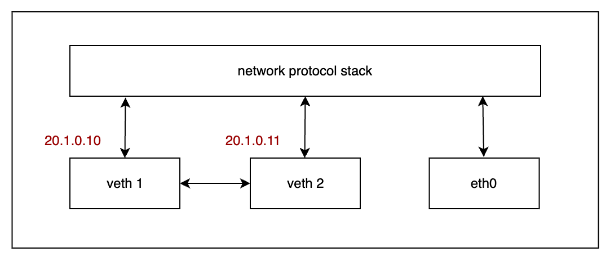

## Network Namespace

Một từ khoá mà từ hồi năm 3 đại học đến bây giờ mình đã học và nghe rất nhiều đó là `isolation`, tiếng Việt có nghĩa là sự tách biệt, không ảnh hưởng lẫn nhau, những ngữ cảnh mình tiếp xúc với khái niệm này theo thời gian như sau:

- `database transaction`: transaction phải thực thi độc lập và không được ảnh hưởng lẫn nhau.
- `multi-tenant architecture`: nhóm mình sử dụng kiến trúc này để luận văn tốt nghiệp, đại ý thì tài nguyên, dữ liệu của các tenant phải được độc lập hoàn toàn với nhau.
- `cloud`: sử dụng các công nghệ ảo hoá để tạo ra các máy trên chung một thiết bị vật lý, giống với việc ở trên thì nhà cung cấp dịch vụ cloud cần có cơ chế để các người dùng cuối không bị ảnh hưởng đến nhau, ví dụ số đơn vị tính toán vật lí (cpu) được chia sẻ theo đúng cấu hình máy ảo, routing đúng các gói tin,...
- `linux namespace`: những process chạy trong những namespace khác nhau cũng hoàn toàn độc lập, không sử dụng chung tài nguyên. 

Ý cuối trong danh sách trên, `namespace` là một công nghệ cơ bản không thể thiếu trong thế giới ảo hoá ngày nay, với một ví dụ rất nổi tiếng, 2024, lập trình viên không ai là không biết docker.

Về chức năng, `namespace` tạo ra các môi trường với sự độc lập về tài nguyên, trong linux, có các namespace sau:

- `Mount` - cung cấp sự độc lập về việc mount hệ thống file (process trong cách ns khác nhau không thể xem file của nhau)
- `UTS` - cung cấp sự độc lập lập về hostname và domain name
- `IPC` - cung cấp sự độc lập về tài nguyên giao tiếp giữa các process
- `PID` - cung cấp sự độc lập về số PID
- `Network` - cung cấp sự độc lập về network interface
- `User` - cung cấp sự độc lập về số UID/GID
- `Cgroup` - cung cấp sự độc lập về thư mục gốc cgroup

Bài này viết sẽ tập trung vào `network namespace`, có chứng năng tạo ra các môi trường network độc lập, cho phép các process trong các `network namespace` có network stack khác nhau, bao gồm routing policy, network interface, firewal policy,...

## Virtual ethernet

`Virtual ethernet` cho phép các process ở các `network namespace` giao tiếp với nhau, ví dụ điển hình nhất là cho phép các container giao tiếp với bên ngoài.



### Veth pair cùng network namespace

Tuy nhiên, đầu tiên hãy bắt đầu trước với mô hình 2 virtual ethernet trên cùng một network namespace.



Một virtual ethernet có 2 đầu, 1 đầu kết nối với network protocol stack, đầu còn lại kết nối trực tiếp với một virtual ethernet khác, một packet được gửi đi bởi một `veth` sẽ trực tiếp đi đến `veth` còn lại. 

Mỗi `virtual ethernet` có thể được cấu hình với một địa chỉ IP để tham gia vào quá trình routing ở layer 3 trong mô hình OSI. Để hiểu hơn cách các `veth` hoạt động, mình sử dụng công cụ `ip` và `tcpdump` để tạo ra 2 `veth` và bắt các gói tin đi qua các thiết bị này. 

Giống như mô hình ở trên, mình tạo ra 2 `veth` với địa chỉ tương ứng `20.1.0.10/24`, `20.1.0.10/24`

```bash
ip link add veth1 type veth peer name veth2
ip addr add 20.1.0.10/24 dev veth1
ip addr add 20.1.0.11/24 dev veth2
ip link set veth1 up
ip link set veth2 up
```

Sử dụng lệnh `ip a`, chúng ta sẽ thấy 2 `veth` mới được tạo ra như sau:

```
15: veth2@veth1: <BROADCAST,MULTICAST,UP,LOWER_UP> mtu 1500 qdisc noqueue state UP group default qlen 1000
    link/ether 96:83:73:29:10:2a brd ff:ff:ff:ff:ff:ff
    inet 20.1.0.11/24 scope global veth2
       valid_lft forever preferred_lft forever
16: veth1@veth2: <BROADCAST,MULTICAST,UP,LOWER_UP> mtu 1500 qdisc noqueue state UP group default qlen 1000
    link/ether 8a:f2:73:9f:32:8f brd ff:ff:ff:ff:ff:ff
    inet 20.1.0.10/24 scope global veth1
       valid_lft forever preferred_lft forever
```

Sử dụng lệnh `ping` để kiểm tra routing giữa 2 `veth`

```bash
ping -c 2 20.1.0.11 -I veth1
```

Kết quả:

```
PING 20.1.0.11 (20.1.0.11) from 20.1.0.10 veth1: 56(84) bytes of data.
From 20.1.0.10 icmp_seq=1 Destination Host Unreachable
From 20.1.0.10 icmp_seq=2 Destination Host Unreachable

--- 20.1.0.11 ping statistics ---
2 packets transmitted, 0 received, +2 errors, 100% packet loss, time 1052ms
```

Kết quả cho thấy packet được gửi đi từ `veth1` không tới được `veth2`, sử dụng `tcpdump` trên `veth2` mình thấy được:

```
09:58:45.556898 ARP, Request who-has 20.1.0.11 tell 20.1.0.10, length 28
09:58:46.608280 ARP, Request who-has 20.1.0.11 tell 20.1.0.10, length 28
09:58:47.631847 ARP, Request who-has 20.1.0.11 tell 20.1.0.10, length 28
```

`ARP` là một giao thức hoạt động với địa chỉ MAC, giao thức `ICMP` và `IP` sẽ được đóng gói tại layer 2, `ethernet frame` sẽ có địa chỉ MAC của thiết bị nguồn và đích, để biết được địa chỉ MAC của thiết bị đích, layer 2 sử dụng giao thức `ARP`, đối với một số hệ điều hành, thiết lập mặc định của kernel sẽ không cho phép `virtual ethernet` trả về gói tin `ARP`, để xử lý vấn đề này, chạy các câu lệnh sau:

```bash
echo 1 > /proc/sys/net/ipv4/conf/veth1/accept_local
echo 1 > /proc/sys/net/ipv4/conf/veth2/accept_local
echo 0 > /proc/sys/net/ipv4/conf/veth1/rp_filter
echo 0 > /proc/sys/net/ipv4/conf/veth2/rp_filter
echo 0 > /proc/sys/net/ipv4/conf/all/rp_filter
```

Lúc này, kết quả của lệnh `tcpdump` ở `veth1` và `veth2` giống nhau:

```
10:51:11.613771 IP 20.1.0.10 > 20.1.0.11: ICMP echo request, id 48, seq 1, length 64
10:51:12.641213 IP 20.1.0.10 > 20.1.0.11: ICMP echo request, id 48, seq 2, length 64
```

Tuy nhiên, nhìn vào kết quả, ta sẽ thấy điều bất thường, tại sao chỉ có mỗi gói tin `request`, gói tin `reply` ở đâu???

Lý giải cho điều này, chúng ta hãy cùng nhìn lại mô hình ở hình trên, gói tin từ `veth2` sẽ được `network protocol stack` xử lý, nó nhận thấy `20.1.0.10` (địa chỉ nguồn gửi gói tin `PING`) là một địa chỉ local nên sẽ tạo ra gói tin `reply` và gửi vào interface `lo`, `lo` nhận được gói tin thì đẩy lên `network protocol stack` lại và được xử lý luôn bởi `ping process` đang chạy ở `user space`, kết quả của lệnh `tcpdump` trên `lo` chứng minh điều này:

```
10:55:47.347658 IP 20.1.0.11 > 20.1.0.10: ICMP echo reply, id 50, seq 1, length 64
10:55:48.412648 IP 20.1.0.11 > 20.1.0.10: ICMP echo reply, id 50, seq 2, length 64
```

Từ ví dụ này, chúng ta có kết luận lại việc gói tin được gửi đi từ một `veth` thì sẽ đi vào `veth` còn lại.

### Veth pair khác network namespace

Phần trên dành nhiều thời gian giải thích cách `veth pair` hoạt động, phần này mình sẽ đưa ra một ví dụ thực tế hơn, đó là việc giao tiếp giữa 2 network namespace khác nhau.

```bash
# tạo mới 1 network namespace
ip netns add ns-example

# tạo cặp veth
ip link add veth3 type veth peer name veth4

# gán veth4 vào namespace ns-example
ip link set veth4 netns ns-example

ip addr add 192.168.10.1/24 dev veth3
ip link set veth3 up

# setup veth in another network namespace
ip netns exec ns-example ip addr add 192.168.10.2/24 dev veth4
ip netns exec ns-example ip link set veth4 up
ip netns exec ns-example ip link set lo up
```

Kiểm tra với lệnh `ping` và `tcpdump`

```bash
# terminal 1
ping -c 2 192.168.10.2

# terminal 2
ip netns exec ns-example tcpdump -i eth4
```

Kết quả của lệnh `tcpdump`

```
11:12:25.968386 IP 192.168.10.1 > 192.168.10.2: ICMP echo request, id 55, seq 1, length 64
11:12:25.968465 IP 192.168.10.2 > 192.168.10.1: ICMP echo reply, id 55, seq 1, length 64
11:12:26.991266 IP 192.168.10.1 > 192.168.10.2: ICMP echo request, id 55, seq 2, length 64
11:12:26.991340 IP 192.168.10.2 > 192.168.10.1: ICMP echo reply, id 55, seq 2, length 64
```

## Tổng kết

Qua bài này, hy vọng bạn có thể hiểu thêm về khái niệm `virtual ethernet` trong linux, cách hoạt động của lệnh `ping` và hành trình của gói tin trong hệ thống.

- `Network namespace` cung cấp các môi trường network độc lập với cách tính năng đầy đủ nhưng `network protocol stack`, `routing policy`, `filewwall policy`,...
- Gói tin đi ra từ 1 `veth` thì sẽ đi vào trực tiếp `veth` còn lại trong `veth pair`.
- Các process trong các `network namespace` khác nhau có thể sử dụng `veth pair` để giao tiếp với nhau.


## Tham khảo

- https://www.sobyte.net/post/2022-04/network-virtualization-veth-pair
- https://networklessons.com/cisco/ccie-routing-switching-written/arp-address-resolution-protocol-explained
- https://medium.com/@amazingandyyy/introduction-to-network-namespaces-and-virtual-ethernet-veth-devices-304e0c02d084
- https://www.redhat.com/en/blog/7-linux-namespaces